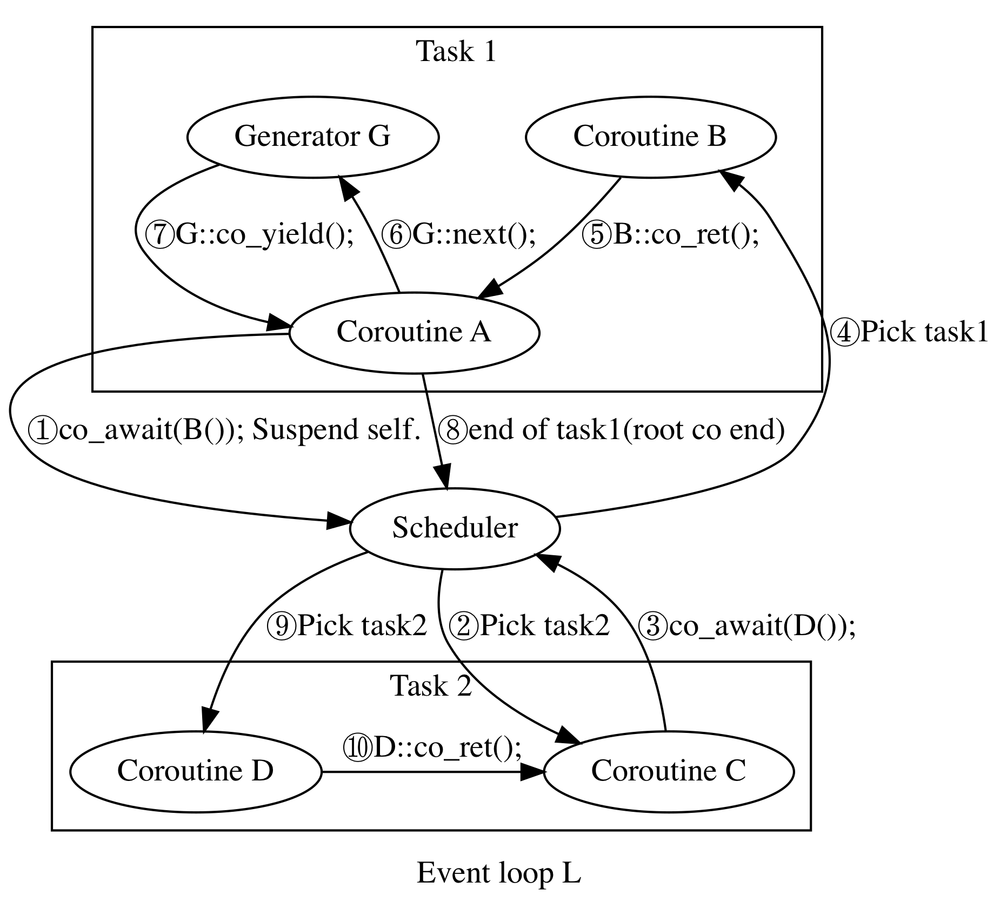

<!--
 * @Author: your name
 * @Date: 2021-11-05 14:22:42
 * @LastEditTime: 2021-11-05 23:34:09
 * @LastEditors: Please set LastEditors
 * @Description: 打开koroFileHeader查看配置 进行设置: https://github.com/OBKoro1/koro1FileHeader/wiki/%E9%85%8D%E7%BD%AE
 * @FilePath: /joblib/README.md
-->
# C++ version of python module 'joblib'

## Build
### CMake
Generate and build:
```shell
chmod +x cmake-build.sh
./cmake-build.sh debug  # or release/reldeb
```
shared libraries and executable files is in cmake-build-debug

### xmake
Generate and build:
```shell
xmake f -m debug    # or release/reldeb
xmake
```
shared libraries and executable files is in xmake-build

### Parallel/async_stackless
`stackless::co`: **Stackless coroutine**

`stackless::async_task`: Async task with standalone user stack (implemented with assembly). use a root coroutine to create an async_task.

`stackless::event_loop`: Wrapped by several async_tasks. Switching between `stackless::co` do not need to switch stack, which is Asymmetric. Switching between `stackless::async_task` will save the context(necessary registers and stack pointer) and switch to a new stack, which is Symmetrical.

Below shows the flow of main::test_for_co_stkless()
 
